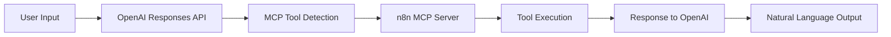

# MCP with n8n Integration

This project demonstrates how to use OpenAI's Responses API with MCP (Model Context Protocol) support to connect to an n8n MCP server.

## Overview

OpenAI now provides native MCP support through their Responses API, making it incredibly simple to connect to remote MCP servers. This project shows how to:

* Use OpenAI's Responses API with MCP tools
* Connect to an n8n MCP server
* Execute calculator and CRM operations through natural language

## Features

* ✅ Simple, clean implementation using OpenAI's native MCP support
* ✅ Environment variable configuration with `python-dotenv`
* ✅ Error handling
* ✅ Multiple example use cases
* ✅ Secure API key management
* ✅ Dependency management with UV

## Prerequisites

* Python 3.13+
* [UV](https://github.com/astral-sh/uv) - Fast Python package manager
* OpenAI API key
* Access to n8n MCP server (https://n8n-alex.zeabur.app/mcp/calculator/sse)

## Installation

### Quick Start (Using Make)

1. Clone the repository:

```bash
git clone <repository-url>
cd mcp-with-n8n
```

2. Install dependencies using Make:

```bash
# Install UV (if not already installed)
make setup-uv

# Install production dependencies
make install

# Or install all dependencies (including dev)
make install-dev
```

3. Create a `.env` file from the example:

```bash
cp .env.example .env
# Edit .env with your API key
```

4. Run the application:

```bash
make run
```

### Manual Installation

1. Clone the repository:

```bash
git clone <repository-url>
cd mcp-with-n8n
```

2. Install UV (if not already installed):

```bash
# On macOS/Linux
curl -LsSf https://astral.sh/uv/install.sh | sh

# On Windows
powershell -c "irm https://astral.sh/uv/install.ps1 | iex"
```

3. Create a virtual environment and install dependencies:

```bash
# Create virtual environment with Python 3.13
uv venv --python 3.13

# Activate the virtual environment
# On macOS/Linux:
source .venv/bin/activate
# On Windows:
.venv\Scripts\activate

# Install dependencies
uv pip sync requirements.txt

# Or install with dev dependencies
uv pip sync requirements.txt requirements-dev.txt
```

4. Create a `.env` file in the project root:

```env
OPENAI_API_KEY=your-openai-api-key-here
MCP_SERVER=https://n8n-alex.zeabur.app/mcp/calculator/sse
MCP_SERVER_TOKEN=optional-auth-token-if-needed
```

## Usage

### Basic Usage

Run the main script:

```bash
python main.py
```

This will execute three examples:
1. Calculator operation (123 + 456)
2. CRM query (listing customers with "潛在機會" status)

### Code Example

```python
from openai import OpenAI
from dotenv import load_dotenv
import os

# Load environment variables
load_dotenv()

# Initialize client
client = OpenAI(api_key=os.getenv("OPENAI_API_KEY"))

# Call with MCP
response = client.responses.create(
    model="gpt-4.1",
    tools=[
        {
            "type": "mcp",
            "server_label": "n8n-mcp-server",
            "server_url": "https://n8n-alex.zeabur.app/mcp/calculator/sse",
            "require_approval": "never"
        }
    ],
    input="Calculate 123 + 456"
)

print(response.output_text)
```

## Available MCP Tools

Based on the n8n server configuration, the following tools are available:

1. **calculator**: Mathematical calculations
   - Example: "Calculate 123 + 456"

2. **CRM_Create**: Create CRM records
   - Requires specific field values

3. **CRM_ListAll**: List all CRM records
   - Can filter by status or other fields

4. **CRM_GET**: Get specific CRM record
   - Requires Record_ID

## How It Works



## Development

### Makefile Commands

The project includes a Makefile for common tasks:

```bash
make help         # Show available commands
make setup-uv     # Install UV package manager
make install      # Install production dependencies
make install-dev  # Install all dependencies including dev
make clean        # Remove virtual environment and cache
make run          # Run the main script
```

### Adding Dependencies

To add new dependencies to the project:

```bash
# Add a production dependency
uv pip install package-name
uv pip freeze > requirements.txt

# Or edit pyproject.toml and sync
uv pip sync
```

### Installing Optional Dependencies

To install optional dependencies (e.g., for alternative implementations):

```bash
uv pip install -e ".[alternative]"
```

## Security Notes

1. **Never commit `.env` files** - The `.gitignore` is configured to exclude them
2. Store API keys securely
3. Use environment variables for all sensitive data
4. Review data being sent to MCP servers
5. Use `require_approval` parameter to control tool execution

## MCP Server Authentication

If your MCP server requires authentication, add headers:

```python
response = client.responses.create(
    model="gpt-4.1",
    tools=[
        {
            "type": "mcp",
            "server_label": "n8n-mcp-server",
            "server_url": MCP_SERVER_URL,
            "require_approval": "never",
            "headers": {
                "Authorization": f"Bearer {os.getenv('MCP_SERVER_TOKEN')}"
            }
        }
    ],
    input=user_message
)
```

## Project Structure

```
mcp-with-n8n/
├── main.py              # Simple implementation using Responses API
├── .env                 # Environment variables (not in git)
├── .env.example        # Example environment file
├── .gitignore          # Git ignore rules
├── .python-version     # Python version specification (3.13)
├── .tool-versions      # asdf/mise version specification
├── pyproject.toml      # Project metadata and dependencies
├── requirements.txt    # Production dependencies for UV
├── requirements-dev.txt # Development dependencies for UV
├── Makefile            # Automation commands
├── README.md           # This file
└── uv.lock            # Dependency lock file
```

## Troubleshooting

### Common Issues

1. **"OPENAI_API_KEY not found"**: Ensure `.env` file exists and contains valid API key
2. **MCP Server connection errors**: Check server URL and network connectivity
3. **Model not found**: Ensure you're using a supported model (gpt-4.1, gpt-4o, etc.)
4. **UV not found**: Make sure UV is installed and available in your PATH

### Debug Tips

* Check the response object for detailed error messages
* Verify MCP server is accessible
* Ensure proper authentication headers if required
* Use `uv pip list` to verify installed packages

## Contributing

1. Fork the repository
2. Create a feature branch
3. Make your changes
4. Add tests if applicable
5. Submit a pull request

## Resources

* [OpenAI Responses API Documentation](https://platform.openai.com/docs/api-reference/responses)
* [OpenAI MCP Guide](https://platform.openai.com/docs/guides/tools-remote-mcp)
* [Model Context Protocol Specification](https://modelcontextprotocol.io/)
* [n8n Documentation](https://docs.n8n.io/)
* [UV Documentation](https://github.com/astral-sh/uv)

## License

See [MIT](https://github.com/qwedsazxc78/mcp-client-with-n8n/blob/main/LICENSE) file for details.
